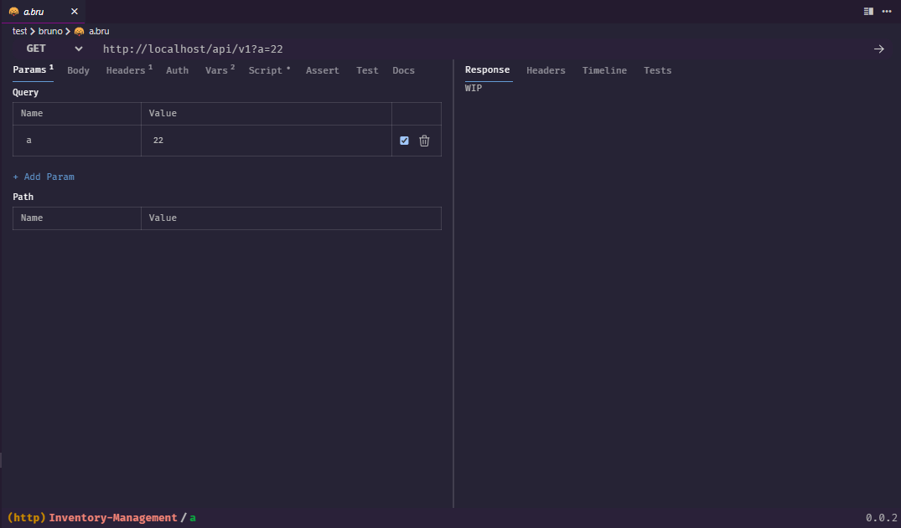

# VS-Bruno

**VS-Bruno** is a Visual Studio Code extension designed to provide a graphical interface for `.bru` files, used by [Bruno](https://usebruno.com/) — an open-source HTTP client. It reads and displays `.bru` API definitions in a clean, customizable visual editor, allowing you to modify requests, parameters, and bodies directly from within VSCode.

 <!-- Optional: Add a screenshot -->

## ✨ Features

- 🔍 Graphical interface for `.bru` files
- 📝 Edit request method, URL, parameters, and body
- 🔄 Two-way sync with `.bru` source
- ⌨️ Open `.bru` as plain text (F7)

## 🧠 Usage

1. Open a `.bru` file in VSCode.
2. The editor will automatically show a graphical interface.
3. Press `F7` to toggle plain text view.

## 🛠️ Developer

Built using:
- React + TailwindCSS
- TypeScript + Bun + ESBuild
- VSCode Custom Editor API